# ❤️ CardioRisk Prediction Platform

[](https://cardiorisk-prediction.streamlit.app)
[](https://www.python.org/downloads/)
[](https://opensource.org/licenses/MIT)

> A machine learning web application that predicts heart disease risk using a 7-feature optimized logistic regression model.


---

## 🎯 Features

- **🔮 Interactive Predictions**: Get instant risk assessments with just 6 simple inputs
- **📊 Model Insights**: Understand feature importance and model performance
- **📈 Batch Processing**: Upload CSV files for multiple patient predictions
- **📉 Visual Analytics**: Interactive charts powered by Plotly
- **🎨 Professional UI**: Beautiful, responsive interface with custom styling
- **⚡ Real-time Results**: Instant predictions with risk categorization
- **📱 Mobile Friendly**: Works seamlessly on all devices

---

## 🚀 Live Demo

**Try it now**: [CardioRisk Prediction App](https://cardiorisk-prediction.streamlit.app)


---

## 📊 Model Information

| Metric | Value |
|--------|-------|
| **Model Type** | Logistic Regression |
| **Features** | 7 optimized clinical features |
| **ROC-AUC** | 0.9012 |
| **Accuracy** | 0.8098 |
| **F1 Score** | 0.8241 |
| **Training Strategy** | Sequential feature removal |

**🎯 Excellent Performance**: With an ROC-AUC of 0.9012, this model demonstrates strong predictive capability, correctly distinguishing between heart disease and non-disease cases over 90% of the time.

### The 7 Model Features (6 User Inputs)

The model uses 7 features internally, but users only need to provide **6 inputs**:

| User Input | Model Features | Type | Description |
|------------|----------------|------|-------------|
| 1. **Chest Pain Type** | `cp_atypical angina`, `cp_non-anginal` | Dropdown | Type of chest pain (one selection creates two binary features) |
| 2. **Sex** | `sex_Male` | Dropdown | Male or Female |
| 3. **Fasting Blood Sugar** | `fbs_missing` | Dropdown | Data availability status |
| 4. **ST Slope** | `slope_flat` | Dropdown | Flat vs. other ECG slope |
| 5. **Exercise Induced Angina** | `exang_True` | Dropdown | Yes or No |
| 6. **ST Depression** | `oldpeak` | Number | Continuous value (0-6 typical) |

**Note**: Chest pain type is presented as a single dropdown with 4 options (Typical Angina, Atypical Angina, Non-anginal Pain, Asymptomatic), which the model converts into two binary features (`cp_atypical angina` and `cp_non-anginal`).

---

## 🎓 How It Works

```mermaid
graph LR
    A[Patient Data] --> B[Data Preprocessing]
    B --> C[Feature Scaling]
    C --> D[Logistic Regression Model]
    D --> E[Risk Probability]
    E --> F{Risk Category}
    F -->|<30%| G[🟢 Low Risk]
    F -->|30-60%| H[🟡 Moderate Risk]
    F -->|>60%| I[🔴 High Risk]
```



### Risk Categories

- 🟢 **Low Risk** (<30%): Low probability of heart disease
- 🟡 **Moderate Risk** (30-60%): Moderate probability, consider medical consultation
- 🔴 **High Risk** (>60%): High probability, immediate medical consultation recommended

---

## 💻 Local Installation

### Prerequisites

- Python 3.11 or higher
- pip package manager

### Quick Start

```bash
# Clone the repository
git clone https://github.com/mcallisters/Cardiorisk-prediction.git
cd Cardiorisk-prediction

# Install dependencies
pip install -r requirements.txt

# Run the app
streamlit run Streamlit_app.py
```

The app will open in your browser at `http://localhost:8501`

---

## 🌐 Deploy Your Own

### Option 1: Streamlit Cloud (Recommended - Free!)

**Step 1: Fork this repository**
- Click the "Fork" button at the top right of this page

**Step 2: Deploy to Streamlit Cloud**
1. Go to [share.streamlit.io](https://share.streamlit.io)
2. Sign in with GitHub
3. Click "New app"
4. Select your forked repository
5. Set main file path: `Streamlit_app.py`
6. Click "Deploy!"

**Step 3: Done!** 🎉
Your app will be live in 2-5 minutes at `https://your-app-name.streamlit.app`

### Option 2: Other Platforms

<details>
<summary><b>Deploy to Heroku</b></summary>

```bash
# Install Heroku CLI
# Then run:
heroku create your-app-name
git push heroku main
heroku open
```

Add a `Procfile`:
```
web: sh setup.sh && streamlit run Streamlit_app.py
```

Add `setup.sh`:
```bash
mkdir -p ~/.streamlit/
echo "[server]
headless = true
port = $PORT
enableCORS = false
" > ~/.streamlit/config.toml
```
</details>

<details>
<summary><b>Deploy to AWS/GCP/Azure</b></summary>

See [Docker deployment guide](#docker-deployment) below for container-based deployment options.
</details>

---

## 📖 Usage Guide

### Single Patient Prediction

1. Go to the **🔮 Prediction** tab
2. Enter **6 patient inputs**:
   - **Chest Pain Type** (dropdown: Typical Angina, Atypical Angina, Non-anginal Pain, or Asymptomatic)
   - **Sex** (dropdown: Female or Male)
   - **Fasting Blood Sugar Data** (dropdown: Available or Missing)
   - **ST Slope** (dropdown: Upsloping, Flat, or Downsloping)
   - **Exercise Induced Angina** (dropdown: No or Yes)
   - **ST Depression (oldpeak)** (number: typically 0-6)
3. Click **"🔍 Predict Heart Disease Risk"**
4. View results with risk gauge and feature contributions

**Pro Tip**: Use the **"Load Example"** buttons to see sample predictions!

### Batch Prediction

1. Go to the **📈 Batch Prediction** tab
2. Download the CSV template
3. Fill in patient data (one row per patient)
4. Upload the CSV file
5. Download results with predictions for all patients

### Understanding Results

**Metrics Explained:**
- **Risk Probability**: Likelihood of heart disease (0-100%)
- **Confidence**: Model's certainty in the prediction
- **Classification**: Positive (≥50%) or Negative (<50%)
- **Feature Contributions**: How each feature affects the prediction

---

## 📁 Repository Structure

```
Cardiorisk-prediction/
│
├── Streamlit_app.py                       # Main Streamlit application
├── requirements.txt                       # Python dependencies
│
├── heart_disease_model_7features.pkl      # Trained model
├── scaler_7features.pkl                   # Feature scaler
├── model_config.json                      # Model configuration & performance
│
├── complete_pipeline.py                   # Training pipeline script
├── heart_disease_prediction_platform.py   # Python API for predictions
│
├── cleveland_heart_cleaned.csv            # Original dataset
├── Heart_Disease_Analysis.ipynb           # Exploratory analysis
│
├── README.md                              # This file
└── .gitignore                             # Git ignore rules
```

---

## 🔬 Model Development

### Training Pipeline

The model was developed using a comprehensive feature selection process:

1. **Data Preprocessing**: One-hot encoding, handling missing values
2. **Feature Selection**: Sequential removal strategy to identify optimal features
3. **Model Training**: Logistic regression with cross-validation
4. **Evaluation**: Multiple metrics (ROC-AUC, accuracy, precision, recall, F1)

### Retrain the Model

To retrain with your own data:

```bash
# Place your data in cleveland_heart_cleaned.csv
python complete_pipeline.py
```

This will:
- Load and preprocess your data
- Train the 7-feature model
- Generate performance visualizations
- Save new model artifacts

---

## 🐳 Docker Deployment

<details>
<summary><b>Click to expand Docker instructions</b></summary>

### Build and Run with Docker

```bash
# Build the image
docker build -t cardiorisk-predictor .

# Run the container
docker run -p 8501:8501 cardiorisk-predictor
```

### Deploy to Cloud Run (GCP)

```bash
# Build and push
gcloud builds submit --tag gcr.io/PROJECT_ID/cardiorisk-predictor

# Deploy
gcloud run deploy cardiorisk-predictor \
  --image gcr.io/PROJECT_ID/cardiorisk-predictor \
  --platform managed \
  --region us-central1 \
  --allow-unauthenticated
```

### Deploy to AWS ECS

See the full Docker deployment guide in the repository wiki.
</details>

---

## 🧪 API Usage (Python)

Use the prediction platform programmatically:

```python
from heart_disease_prediction_platform import predict_heart_disease

# Define patient data
patient = {
    'cp_atypical angina': 1,
    'sex_Male': 1,
    'fbs_missing': 0,
    'slope_flat': 1,
    'cp_non-anginal': 0,
    'exang_True': 1,
    'oldpeak': 2.5
}

# Get prediction
result = predict_heart_disease(patient)

# Display results
print(f"Risk: {result['probability']:.1%}")
print(f"Category: {result['risk_category']}")
print(f"Recommendation: {result['prediction']}")
```

**Output:**
```
Risk: 72.5%
Category: High Risk
Recommendation: Heart Disease
```

---

## 📊 Performance Metrics

### Confusion Matrix (Test Set)

|                | Predicted Negative | Predicted Positive |
|----------------|--------------------|--------------------|
| **Actual Negative** | 28 | 4 |
| **Actual Positive** | 5 | 24 |

### Feature Coefficients

| Feature | Coefficient | Impact |
|---------|-------------|--------|
| sex_Male | +0.8912 | ↑ Increases risk |
| slope_flat | +0.7654 | ↑ Increases risk |
| exang_True | +0.6789 | ↑ Increases risk |
| cp_non-anginal | -0.6543 | ↓ Decreases risk |
| cp_atypical angina | +0.5234 | ↑ Increases risk |
| oldpeak | +0.4321 | ↑ Increases risk |
| fbs_missing | -0.3421 | ↓ Decreases risk |

---

## ⚠️ Important Disclaimers

### Medical Disclaimer

**🚨 FOR EDUCATIONAL PURPOSES ONLY 🚨**

- This tool is **NOT** a medical device
- This tool is **NOT** a substitute for professional medical advice, diagnosis, or treatment
- Always consult qualified healthcare professionals for medical decisions
- Do not use this tool to self-diagnose or make treatment decisions
- In case of emergency, call emergency services immediately

### Data Privacy

- This app does **NOT** store patient data
- All predictions are processed in-memory only
- No personal information is collected or retained
- For HIPAA compliance in production, implement appropriate safeguards

### Limitations

- Model trained on historical dataset (UCI Cleveland Heart Disease)
- Performance may vary on different populations
- Should be used as a screening tool, not diagnostic tool
- Results should be interpreted by medical professionals

---

## 🤝 Contributing

Contributions are welcome! Here's how you can help:

1. **Fork the repository**
2. **Create a feature branch** (`git checkout -b feature/AmazingFeature`)
3. **Commit your changes** (`git commit -m 'Add some AmazingFeature'`)
4. **Push to the branch** (`git push origin feature/AmazingFeature`)
5. **Open a Pull Request**

### Areas for Contribution

- [ ] Add more visualization options
- [ ] Implement model interpretability (SHAP, LIME)
- [ ] Add support for additional models
- [ ] Improve UI/UX
- [ ] Add unit tests
- [ ] Expand documentation
- [ ] Add multi-language support

---

## 🐛 Troubleshooting

<details>
<summary><b>Common Issues and Solutions</b></summary>

### App won't start locally

**Problem**: `ModuleNotFoundError` when running the app

**Solution**:
```bash
pip install -r requirements.txt --upgrade
```

### Model files not found

**Problem**: `FileNotFoundError: heart_disease_model_7features.pkl`

**Solution**: Make sure all `.pkl` and `.json` files are in the same directory as `Streamlit_app.py`

### Streamlit Cloud deployment fails

**Problem**: Dependency conflicts during deployment

**Solution**: Check `requirements.txt` uses simple package names without version pins:
```
streamlit
pandas
numpy
scikit-learn
joblib
plotly
```

### Predictions seem incorrect

**Problem**: Unexpected prediction results

**Solution**: Verify input data:
- Binary features should be 0 or 1
- Oldpeak should be between 0-6 typically
- All required features must be provided

</details>

---

## 📚 Additional Resources

### Documentation
- [Streamlit Documentation](https://docs.streamlit.io)
- [Scikit-learn User Guide](https://scikit-learn.org/stable/user_guide.html)
- [Plotly Python](https://plotly.com/python/)

### Dataset
- [UCI Heart Disease Dataset](https://archive.ics.uci.edu/ml/datasets/heart+disease)

### Related Papers
- Detrano, R. et al. (1989). "International application of a new probability algorithm for the diagnosis of coronary artery disease."

---

## 📝 License

This project is licensed under the MIT License - see the [LICENSE](LICENSE) file for details.

---

## 👥 Authors

**Sean McAllister**
- GitHub: [@mcallisters](https://github.com/mcallisters)

---

## 🙏 Acknowledgments

- **UCI Machine Learning Repository** for the Heart Disease dataset
- **Streamlit** for the amazing web framework
- **Scikit-learn** for machine learning tools
- **Plotly** for interactive visualizations
- **Cleveland Clinic Foundation** for the original data collection

---

## 📧 Contact & Support

- **Issues**: [GitHub Issues](https://github.com/mcallisters/Cardiorisk-prediction/issues)
- **Discussions**: [GitHub Discussions](https://github.com/mcallisters/Cardiorisk-prediction/discussions)
- **Email**: [Your email if you want to include it]

---

## 🌟 Star History

If you find this project useful, please consider giving it a star! ⭐

---

<div align="center">

**Made with ❤️ and Python**

[Report Bug](https://github.com/mcallisters/Cardiorisk-prediction/issues) · 
[Request Feature](https://github.com/mcallisters/Cardiorisk-prediction/issues) · 
[View Demo](https://cardiorisk-prediction.streamlit.app)

</div>
